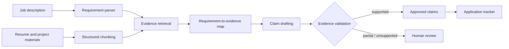
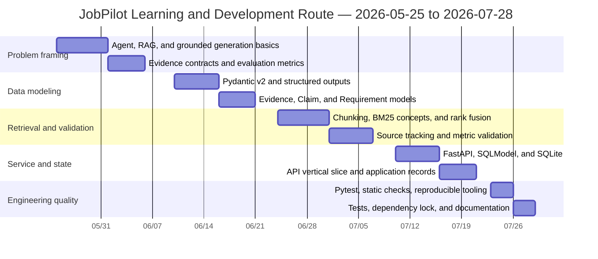

# JobPilot Agent

An evidence-grounded job application copilot that parses job descriptions, retrieves evidence from personal project materials, drafts traceable resume claims, and tracks applications.

> Current status: v0.5.0 provides resumable evidence-grounded workflows, direct document upload, editable claims with server-side revalidation, local workflow history, controlled benchmarks, audited DOCX export, and production packaging. It remains usable without a model API key.

## Why JobPilot

Job seekers repeatedly analyze job descriptions, identify skill gaps, locate project evidence, tailor resumes, write outreach, and track applications. Using a general-purpose language model directly can produce unsupported experience or invented metrics.

JobPilot turns this process into an auditable workflow:

- every exportable claim must reference at least one evidence ID;
- numerical metrics must exist in the source evidence and are never inferred;
- partially supported or unsupported claims are routed to human review;
- v1 does not perform external writes such as email, calendar, or job submission;
- the deterministic evidence pipeline works without an API key.

## Current capabilities

- Parse English and Chinese job descriptions into structured requirements.
- Normalize common skills such as Python, FastAPI, SQL, RAG, LLMs, and LangGraph.
- Load PDF, DOCX, Markdown, and text materials, then chunk them for weighted lexical retrieval.
- Preserve `source_path` and `source_id` in requirement-to-evidence mappings.
- Detect numerical metrics that are absent from the supporting evidence.
- Expose FastAPI endpoints and a responsive browser UI for document upload, tailoring, editable evidence review, workflow history, approval, DOCX export, and application tracking.
- Persist application records with SQLite and SQLModel.
- Test the parsing, retrieval, validation, and API vertical slice.

## Architecture



## Learning and development timeline

This route covers May 25 through the present. It intentionally includes gaps for practice, review, and other commitments; it does not assume continuous daily work. Each learning topic is paired with a concrete project outcome.



| Learning topic | Matching development work | Verification |
|---|---|---|
| Agents, RAG, and grounded generation | Evidence-first architecture and safety rules | A claim cannot be supported without evidence |
| Pydantic v2 | Core data contracts | Model-level validation and type checks |
| Retrieval and chunking | Requirement-to-evidence mapping | Traceable source paths and chunk IDs |
| Claim validation | Metric hallucination guard | Missing metrics are marked `partial` |
| FastAPI and SQLModel | Service API and application tracking | API tests and SQLite persistence |
| Pytest, Ruff, and mypy | Engineering quality gates | Automated tests and static checks |

## Technology decisions

- **Python 3.11**: compatible with current FastAPI, LangGraph, and SQLModel releases, with mature binary-wheel support.
- **FastAPI, Pydantic 2, and SQLModel**: constrained to compatible release ranges in `pyproject.toml`.
- **uv**: manages Python, the virtual environment, and `uv.lock`.
- **SQLite**: local-first persistence with no external service dependency.
- **Pytest, Ruff, and mypy**: testing, linting, formatting, and type checking.
- **LangGraph and OpenAI**: optional `agent` dependencies to be introduced after the deterministic evidence chain is stable.

The current milestone does not require Node.js or Docker. Supported Python versions are `>=3.11,<3.13`, prioritizing compatibility on Windows and with common binary dependencies.

## Quick start

```powershell
git clone https://github.com/<your-account>/JobPilotAgent.git
cd JobPilotAgent
uv sync --extra documents
uv run uvicorn app.api.main:app --reload
```

Open the browser approval interface at `http://127.0.0.1:8000/` or the interactive API documentation at `http://127.0.0.1:8000/docs`.

Run the quality checks:

```powershell
uv run pytest
uv run ruff check .
uv run mypy app
```

## API example

```powershell
$body = @{
  job_description = "We require Python and FastAPI experience to build APIs."
  documents = @(
    @{
      source_id = "project"
      source_path = "README.md"
      content = "Built Python FastAPI endpoints with Pydantic validation."
    }
  )
  language = "en"
} | ConvertTo-Json -Depth 4

Invoke-RestMethod -Method Post `
  -Uri http://127.0.0.1:8000/v1/tailor `
  -ContentType "application/json" -Body $body
```

## Workflow API

The persistent workflow API uses UUID thread IDs and SQLite checkpoints:

- `POST /v1/workflows` starts a run and pauses for claim review.
- `POST /v1/documents/upload` extracts evidence from up to five PDF, DOCX, TXT, or Markdown files without persisting the uploads.
- `GET /v1/workflows` lists recent resumable workflows.
- `GET /v1/workflows/{thread_id}` returns saved state and review payloads.
- `POST /v1/workflows/{thread_id}/clone` creates a fresh run from the saved request.
- `DELETE /v1/workflows/{thread_id}` removes its checkpoints and generated export.
- `POST /v1/workflows/{thread_id}/decision` revalidates optional claim edits, then resumes with an approve or reject decision.
- `GET /v1/workflows/{thread_id}/export` downloads a DOCX after approval.

Without `OPENAI_API_KEY`, the API uses deterministic drafting. With a key configured, it enables the structured Responses writer while preserving local validation and human approval.

## Repository structure

```text
JobPilotAgent/
├── app/
│   ├── api/            # FastAPI entry point
│   ├── schemas/        # Evidence, claim, job, and request models
│   ├── services/       # Parsing, retrieval, validation, and tailoring
│   ├── ui/             # Browser-based human approval interface
│   └── storage/        # SQLite application tracking
├── data/
│   ├── source_docs/    # Local evidence materials
│   └── generated/      # Generated artifacts
├── tests/              # Unit and API tests
├── pyproject.toml
└── README.md
```

## Milestones

### Milestone 1: Evidence-chain core — complete

- Core Pydantic data contracts.
- Deterministic requirement parsing.
- Source-preserving retrieval and evidence mapping.
- Numerical-metric validation.
- FastAPI endpoints and SQLite application tracking.
- Automated tests and a reproducible environment.

### Milestone 2: Document ingestion and retrieval evaluation — baseline complete

- PDF, DOCX, Markdown, and plain-text loaders.
- Bilingual skill aliases and structure-aware chunking.
- A labeled baseline of 30 retrieval queries.
- Current synthetic-baseline Recall@5: 1.00; target on real personal materials: at least 0.85.

Run the reproducible baseline with:

```powershell
uv run python -m evals.score_retrieval
```

### Milestone 3: Agent workflow — complete

- Implemented explicit LangGraph parse, retrieve, draft, approval, and finalize nodes.
- Implemented JSON-serializable state and human review with `interrupt()` / `Command(resume=...)`.
- Implemented SQLite checkpoints and verified recovery in a newly opened graph process.
- Added OpenAI Responses API structured writing with Pydantic parsing.
- Added bounded exponential-backoff retries for transient provider errors.
- Added token accounting and model-aware cost estimates.
- Preserved local evidence-ID and metric validation after model generation.

The workflow remains safe by default: it pauses before claims become exportable and requires an explicit approval decision using the same thread ID. The default model is `gpt-5.6-terra` for a quality/cost balance. Cost estimates use the public rates recorded on 2026-07-28 and should be reviewed when model pricing changes; cached-token adjustments are not yet included.

### Milestone 4: Offline evaluation and export — evaluation/export core complete

- Added 20 claim-level grounding labels covering supported, partial, and unsupported cases.
- Current controlled-fixture results: grounding precision 1.00 and unsupported-claim rate 0.00.
- Added semantic-overlap and expanded numerical-metric validation.
- Added safe DOCX export for approved claims with an Evidence Audit appendix.
- Added a redesigned responsive browser interface for drag-and-drop evidence input, claim review, decisions, usage display, and DOCX download.
- Added privacy-preserving direct document upload with file-count, type, and 5 MB per-file limits.
- Next: latency/cost benchmark runs on representative, privacy-scrubbed materials.

Run both offline baselines with:

```powershell
uv run python -m evals.score_retrieval
uv run python -m evals.score_grounding
uv run python -m evals.benchmark_workflow --runs 5
```

These controlled fixtures are regression baselines, not claims about performance on real resumes or job descriptions. The UI requires no Node.js runtime and is packaged with the Python wheel.

### Milestone 5: Product hardening and operations — baseline complete

- Added editable claim review; every edit is revalidated against its cited evidence before approval.
- Added local workflow history with open, clone, and delete operations.
- Restored verified Chinese deterministic drafting and Chinese numerical-unit validation.
- Added security response headers and metadata-only request logging; request bodies and uploaded content are not logged.
- Added a dry-run-first generated-artifact cleanup command.
- Added a privacy-scrubbed bilingual workflow benchmark. The current deterministic fixture (3 cases, 2 runs) averaged approximately 0.6 ms on the development machine with zero provider cost; machine-specific timing is not a production SLA.
- Added GitHub Actions quality gates, Docker packaging, and Compose persistence.
- Added an explicit online validation command that refuses to run without both an API key and `--confirm-spend`.

Run operational checks with:

```powershell
uv run python -m evals.benchmark_workflow --runs 5
uv run python -m app.maintenance --older-than-days 30
uv run python -m app.maintenance --older-than-days 30 --apply
```

The online writer smoke test is intentionally opt-in and billable:

```powershell
$env:OPENAI_API_KEY = "your-key"
uv run python -m evals.validate_online --confirm-spend
```

Use only privacy-scrubbed fixtures for the first online run. The command prints model, token, claim, blocked-claim, and estimated-cost fields. It was not executed during offline development because no project API key was supplied.

## Deployment

Local container deployment:

```powershell
docker compose up --build
```

The Compose volume persists checkpoints and generated exports under `/data`. The application sets CSP, frame, MIME-sniffing, referrer, and browser-permission headers. For internet-facing deployment, place it behind an authenticated TLS reverse proxy with request-size limits and rate limiting; the built-in UI is designed for trusted local or private-network use and does not claim to provide multi-tenant authentication.
## Development journal and lessons learned

This journal records engineering decisions that materially changed the project. Dates describe the learning and development route rather than implying uninterrupted daily work.

| Period | Problem or learning focus | Decision and project outcome | Reusable lesson |
|---|---|---|---|
| May 25–31 | Grounded generation can still produce fluent but unsupported claims. | Defined evidence IDs, support states, and a rule that exportable claims must cite evidence. | Safety requirements should become data-model invariants, not prompt-only instructions. |
| June 10–20 | Loosely shaped dictionaries made validation and API evolution fragile. | Adopted Pydantic v2 contracts for requirements, evidence, claims, requests, and structured model output. | Typed boundaries make agent state, API payloads, and tests evolve together. |
| June 24–July 6 | Keyword retrieval needed traceability and bilingual normalization. | Added structure-aware chunks, skill aliases, source paths, stable IDs, and Recall@5 fixtures. | Retrieval quality is only useful when its provenance survives every downstream step. |
| July 10–20 | Human approval had to survive process restarts. | Used LangGraph interrupts with SQLite checkpoints and UUID thread IDs. | An approval screen is not a safety boundary unless the underlying state is resumable and auditable. |
| July 23–27 | Model output could contain invented metrics even when evidence IDs looked valid. | Added local post-generation evidence and numerical-metric validation. | Structured model output improves shape, but deterministic validation must still enforce truthfulness. |
| July 28 | PDF/DOCX support introduced optional binary/document dependencies. | Standardized on Python 3.11 and bounded dependency ranges; document support remains an explicit extra. | Choose the runtime with the strongest ecosystem compatibility, then lock exact resolved versions. |
| July 28 | Browser uploads could leak filenames, consume excessive memory, or fail with opaque 500 errors. | Parse in memory, strip path components, cap uploads at five files and 5 MB each, close resources, and convert malformed documents to 422 responses. | Treat uploads as untrusted input even in a local-first application. |
| July 28 | Windows sandbox tooling intermittently returned `helper_unknown_error`, and PowerShell 5 could reinterpret BOM-less UTF-8 as a legacy encoding. | Kept all writes inside the repository, used narrowly scoped approved commands when required, restored text from Git blobs when needed, and wrote UTF-8 explicitly without a BOM. | Tooling failures and product failures are different; preserve a clean Git checkpoint and verify encoding before committing. |
| July 28 | Static UI assets needed to work from an installed wheel without adding a Node runtime. | Kept the interface in packaged HTML/CSS/JavaScript and verified wheel contents plus JavaScript syntax. | A simpler deployment surface can be more valuable than a larger frontend toolchain for a local-first product. |

### Compatibility decisions

| Component | Selected range or version | Reason |
|---|---|---|
| Python | `>=3.11,<3.13` | Stable typing features and strong compatibility with the selected agent, API, and document libraries. |
| FastAPI | `>=0.128,<1` | Pydantic v2 support while avoiding an unreviewed major-version change. |
| LangGraph | `>=1.2,<2` | Supports interrupt/resume workflows and SQLite checkpoint integration. |
| OpenAI Python | `>=2.20,<3` | Supports parsed structured Responses output used by the optional writer. |
| pypdf / python-docx | `>=6.6,<7` / `>=1.2,<2` | Current document parsing APIs with bounded major versions. |
| python-multipart | resolved to `0.0.32` | Required by FastAPI multipart uploads and locked by `uv.lock`. |
| Project release | `0.5.0` | Aligns package and API versions after workflow management, safety, benchmarks, CI, and deployment work. |

### Problems encountered and how to reproduce the checks

- **Windows sandbox helper failure:** this affects some local command launches, not the application runtime. Retry with a narrowly scoped workspace command; do not disable filesystem protections globally.
- **PowerShell UTF-8 handling:** use an editor configured for UTF-8 or explicit .NET UTF-8 APIs when modifying BOM-less files. Always run `git diff --check` and inspect documentation diffs before committing.
- **Malformed PDF or DOCX uploads:** the API returns `422` with a safe parsing message. Unsupported extensions also return `422`; files above 5 MB return `413`.
- **Optional document imports:** if PDF or DOCX support is unavailable, run `uv sync --extra documents`. The core deterministic text workflow remains independently testable.
- **Known test warning:** the current Starlette/FastAPI `TestClient` stack reports an upstream `httpx` deprecation warning. It is monitored rather than suppressed; the dependency range will be changed after the supported migration path is stable.
- **No API key:** leave `OPENAI_API_KEY` unset to use deterministic drafting. This is a supported mode, not a degraded test workaround.
- **Docker verification:** Docker and Compose files are included, but the development Windows environment did not have the Docker CLI installed. The Python package build was verified locally; run `docker compose build` on a Docker-enabled host before production deployment.

Run the engineering gates after environment or dependency changes:

```powershell
uv lock --check
uv run ruff format --check .
uv run ruff check .
uv run mypy app evals
uv run pytest
uv build
```

The controlled retrieval and grounding fixtures should also be rerun whenever parsing, chunking, retrieval, drafting, or validation changes.
## Acceptance targets

- Tailoring cycle under 10 minutes.
- Evidence grounding precision of at least 0.90.
- Unsupported-claim rate below 0.02.
- Retrieval Recall@5 of at least 0.85.
- Resumable interrupted workflows.
- Every exported claim traceable to source material.

These are acceptance targets and will only be marked as achieved after the evaluation suite passes.

## Privacy and safety

`data/source_docs/` may contain personal information. Do not commit real resumes, contact details, API keys, or private company materials to a public repository. `.env`, database files, and generated artifacts are ignored by Git by default.
