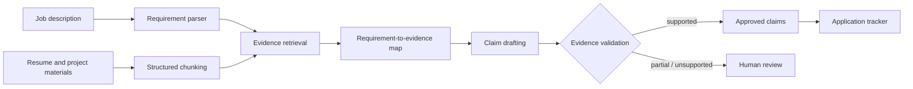
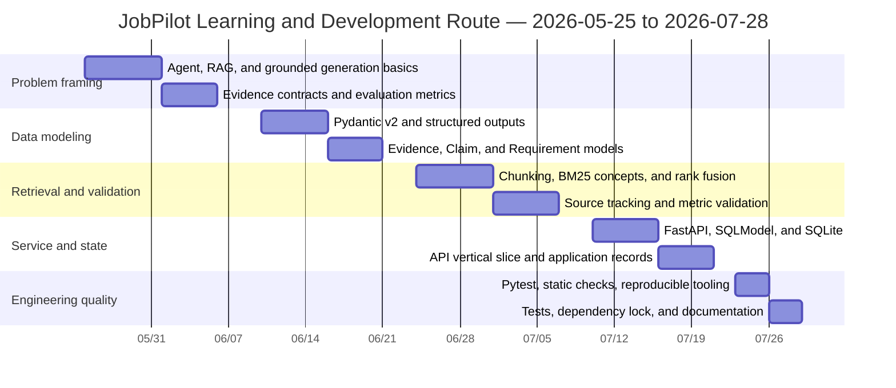

# JobPilot Agent

An evidence-grounded job application copilot that parses job descriptions, retrieves evidence from personal project materials, drafts traceable resume claims, and tracks applications.

> Current status: Milestone 1, the evidence-chain core, is implemented. The project runs and can be tested without a model API key. Generative models and LangGraph orchestration are planned for later milestones.

## Why JobPilot

Job seekers repeatedly analyze job descriptions, identify skill gaps, locate project evidence, tailor resumes, write outreach, and track applications. Using a general-purpose language model directly can produce unsupported experience or invented metrics.

JobPilot turns this process into an auditable workflow:

- every exportable claim must reference at least one evidence ID;
- numerical metrics must exist in the source evidence and are never inferred;
- partially supported or unsupported claims are routed to human review;
- v1 does not perform external writes such as email, calendar, or job submission;
- the deterministic evidence pipeline works without an API key.

## Current capabilities

- Parse English and Chinese job descriptions into structured requirements.
- Normalize common skills such as Python, FastAPI, SQL, RAG, LLMs, and LangGraph.
- Load PDF, DOCX, Markdown, and text materials, then chunk them for weighted lexical retrieval.
- Preserve `source_path` and `source_id` in requirement-to-evidence mappings.
- Detect numerical metrics that are absent from the supporting evidence.
- Expose FastAPI endpoints for health checks, tailoring, and application tracking.
- Persist application records with SQLite and SQLModel.
- Test the parsing, retrieval, validation, and API vertical slice.

## Architecture



## Learning and development timeline

This route covers May 25 through the present. It intentionally includes gaps for practice, review, and other commitments; it does not assume continuous daily work. Each learning topic is paired with a concrete project outcome.



| Learning topic | Matching development work | Verification |
|---|---|---|
| Agents, RAG, and grounded generation | Evidence-first architecture and safety rules | A claim cannot be supported without evidence |
| Pydantic v2 | Core data contracts | Model-level validation and type checks |
| Retrieval and chunking | Requirement-to-evidence mapping | Traceable source paths and chunk IDs |
| Claim validation | Metric hallucination guard | Missing metrics are marked `partial` |
| FastAPI and SQLModel | Service API and application tracking | API tests and SQLite persistence |
| Pytest, Ruff, and mypy | Engineering quality gates | Automated tests and static checks |

## Technology decisions

- **Python 3.11**: compatible with current FastAPI, LangGraph, and SQLModel releases, with mature binary-wheel support.
- **FastAPI, Pydantic 2, and SQLModel**: constrained to compatible release ranges in `pyproject.toml`.
- **uv**: manages Python, the virtual environment, and `uv.lock`.
- **SQLite**: local-first persistence with no external service dependency.
- **Pytest, Ruff, and mypy**: testing, linting, formatting, and type checking.
- **LangGraph and OpenAI**: optional `agent` dependencies to be introduced after the deterministic evidence chain is stable.

The current milestone does not require Node.js or Docker. Supported Python versions are `>=3.11,<3.13`, prioritizing compatibility on Windows and with common binary dependencies.

## Quick start

```powershell
git clone https://github.com/<your-account>/JobPilotAgent.git
cd JobPilotAgent
uv sync --extra documents
uv run uvicorn app.api.main:app --reload
```

Open the interactive API documentation at `http://127.0.0.1:8000/docs`.

Run the quality checks:

```powershell
uv run pytest
uv run ruff check .
uv run mypy app
```

## API example

```powershell
$body = @{
  job_description = "We require Python and FastAPI experience to build APIs."
  documents = @(
    @{
      source_id = "project"
      source_path = "README.md"
      content = "Built Python FastAPI endpoints with Pydantic validation."
    }
  )
  language = "en"
} | ConvertTo-Json -Depth 4

Invoke-RestMethod -Method Post `
  -Uri http://127.0.0.1:8000/v1/tailor `
  -ContentType "application/json" -Body $body
```

## Repository structure

```text
JobPilotAgent/
├── app/
│   ├── api/            # FastAPI entry point
│   ├── schemas/        # Evidence, claim, job, and request models
│   ├── services/       # Parsing, retrieval, validation, and tailoring
│   └── storage/        # SQLite application tracking
├── data/
│   ├── source_docs/    # Local evidence materials
│   └── generated/      # Generated artifacts
├── tests/              # Unit and API tests
├── pyproject.toml
└── README.md
```

## Milestones

### Milestone 1: Evidence-chain core — complete

- Core Pydantic data contracts.
- Deterministic requirement parsing.
- Source-preserving retrieval and evidence mapping.
- Numerical-metric validation.
- FastAPI endpoints and SQLite application tracking.
- Automated tests and a reproducible environment.

### Milestone 2: Document ingestion and retrieval evaluation — baseline complete

- PDF, DOCX, Markdown, and plain-text loaders.
- Bilingual skill aliases and structure-aware chunking.
- A labeled baseline of 30 retrieval queries.
- Current synthetic-baseline Recall@5: 1.00; target on real personal materials: at least 0.85.

Run the reproducible baseline with:

```powershell
uv run python -m evals.score_retrieval
```

### Milestone 3: Agent workflow — complete

- Implemented explicit LangGraph parse, retrieve, draft, approval, and finalize nodes.
- Implemented JSON-serializable state and human review with `interrupt()` / `Command(resume=...)`.
- Implemented SQLite checkpoints and verified recovery in a newly opened graph process.
- Added OpenAI Responses API structured writing with Pydantic parsing.
- Added bounded exponential-backoff retries for transient provider errors.
- Added token accounting and model-aware cost estimates.
- Preserved local evidence-ID and metric validation after model generation.

The workflow remains safe by default: it pauses before claims become exportable and requires an explicit approval decision using the same thread ID. The default model is `gpt-5.6-terra` for a quality/cost balance. Cost estimates use the public rates recorded on 2026-07-28 and should be reviewed when model pricing changes; cached-token adjustments are not yet included.

### Milestone 4: Offline evaluation and export

- 20 job-description fixtures with claim-level labels.
- Grounding precision, unsupported-claim rate, coverage, latency, and cost evaluation.
- DOCX export and a human approval interface.

## Acceptance targets

- Tailoring cycle under 10 minutes.
- Evidence grounding precision of at least 0.90.
- Unsupported-claim rate below 0.02.
- Retrieval Recall@5 of at least 0.85.
- Resumable interrupted workflows.
- Every exported claim traceable to source material.

These are acceptance targets and will only be marked as achieved after the evaluation suite passes.

## Privacy and safety

`data/source_docs/` may contain personal information. Do not commit real resumes, contact details, API keys, or private company materials to a public repository. `.env`, database files, and generated artifacts are ignored by Git by default.
